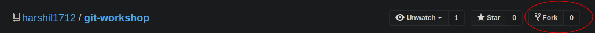
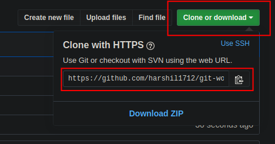

# Git Workshop

Let's learn the concepts of git and take the first step towards contributing to open source.

## Steps to follow

1. To get an experience of how teams collaborate, gather your friends! You'll need a team of 3 people.
1. One person from the lead should fork [this repository](https://github.com/harshil1712/git-workshop) and add other team members as collaborator.

1. Clone the Forked Repository.  

1. Create a new branch with the branch name `<your-name>-card`.
1. Checkout to this newly created branch.
1. Copy lines 45-52 from the `index.js`
1. Paste it below and update it with your information.
1. Add your changes to the staging area.
1. Commit your changes.
1. Push the changes to your branch.
1. Create Pull Request.
1. Tada! You did it!